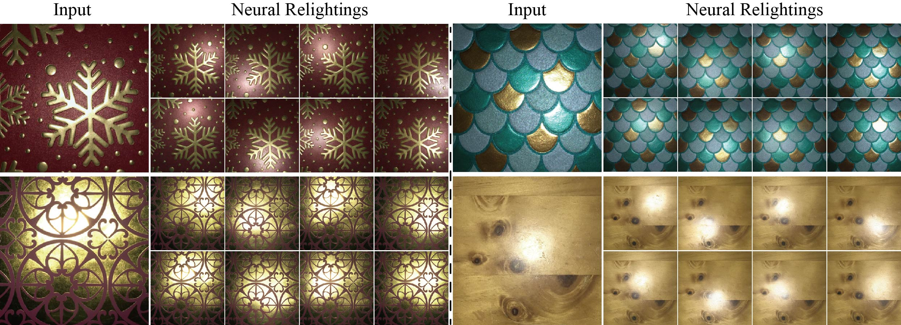

# DGRSISE

**Diffusion-Guided Relighting for Single-Image SVBRDF Estimation** 
*[Youxin Xing](https://xingyouxin.github.io/)*1, *[Zheng Zeng](https://zheng95z.github.io/)*2, *[Youyang Du](https://icewired-yy.github.io/)*1, *[Lu Wang](https://wanglusdu.github.io/)*1✝, *[Beibei Wang](https://wangningbei.github.io/)*3✝
1Shandong University, 2University of California, Santa Barbara, NVIDIA, 3Nanjing University, ✝Corresponding author

**SIGGRAPH Asia 2025 (Conference Track)**

---

  
   
  <em>Figure 1: Our method enables neural material relighting from a single RGB material image without highlight bake-in artifacts.</em>

## 📢 News
* **[2025-11-29]** Code and pretrained weights are released!
* **[2025-08-11]** Paper accepted to SIGGRAPH Asia 2025!

## 📝 Abstract
> Recovering high-fidelity spatially varying bidirectional reflectance distribution function (SVBRDF) maps from a single image remains an ill-posed and challenging problem, especially in the presence of saturated highlights. Existing methods often fail to reconstruct the underlying texture in regions overwhelmed by intense specular reflections. This kind of bake-in artifacts caused by highlight corruption can be greatly alleviated by providing a series of material images under different lighting conditions. To this end, our key insight is to leverage the strong priors of diffusion models to generate images of the same material under varying lighting conditions. These generated images are then used to aid a multi-image SVBRDF estimator in recovering highlight-free reflectance maps. However, strong highlights in the input image lead to inconsistencies across the relighting results. Moreover, texture reconstruction becomes unstable in saturated regions, with variations in background structure, specular shape, and overall material color. These artifacts degrade the quality of SVBRDF recovery. To address this issue, we propose a shuffle-based background consistency module that extracts stable background features and implicitly identifies saturated regions. This guides the diffusion model to generate coherent content while preserving material structures and details. Furthermore, to stabilize the appearance of generated highlights, we introduce a lightweight specular prior encoder that estimates highlight features and then performs grid-based latent feature translation, injecting consistent specular contour priors while preserving material color fidelity. Both quantitative analysis and qualitative visualization demonstrate that our method enables stable neural relighting from a single image and can be seamlessly integrated into multi-input SVBRDF networks to estimate highlight-free reflectance maps..

## 🛠️ Network weights

We provide the pretrained weights of our method on the [Hugging Face Model Hub](https://huggingface.co/Superstarimage/DGRSISE). You can download the weights and use them to reproduce our results.

Our method is implemented in the diffusers framework. A GUI demo version will be presented soon.
